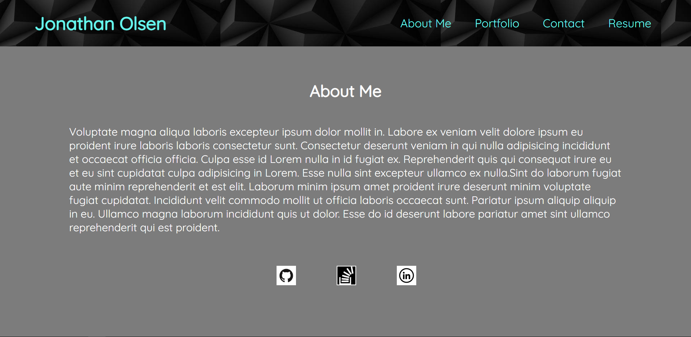

# Jonathan Olsen React Portfolio

## Description:
This application is designed to showcase learned strategies of React. The entire app was created using "create-react-app." Each page you will visit is comprised of multiple custom built react components. When combined, they create a beautiful webpage that displays information on the author, former projects, the ability to contact the author, and a resume. Read futher through this document to find other useful information.

## Table of Contents:
- [The Challenge](#The-Challenge)
- [Usage Information](#Usage-Information)
- [Utilized Programs](#Utilized-Programs)
- [What I Learned](#What-I-Learned)
- [Author](#Author)

## The Challenge

### Assigned User Story:
```md
AS AN employer looking for candidates with experience building single-page applications
I WANT to view a potential employee's deployed React portfolio of work samples
SO THAT I can assess whether they're a good candidate for an open position
```

### Acceptance Criteria:
```md
GIVEN a single-page application portfolio for a web developer
WHEN I load the portfolio
THEN I am presented with a page containing a header, a section for content, and a footer
WHEN I view the header
THEN I am presented with the developer's name and navigation with titles corresponding to different sections of the portfolio
WHEN I view the navigation titles
THEN I am presented with the titles About Me, Portfolio, Contact, and Resume, and the title corresponding to the current section is highlighted
WHEN I click on a navigation title
THEN I am presented with the corresponding section below the navigation without the page reloading and that title is highlighted
WHEN I load the portfolio the first time
THEN the About Me title and section are selected by default
WHEN I am presented with the About Me section
THEN I see a recent photo or avatar of the developer and a short bio about them
WHEN I am presented with the Portfolio section
THEN I see titled images of six of the developer’s applications with links to both the deployed applications and the corresponding GitHub repositories
WHEN I am presented with the Contact section
THEN I see a contact form with fields for a name, an email address, and a message
WHEN I move my cursor out of one of the form fields without entering text
THEN I receive a notification that this field is required
WHEN I enter text into the email address field
THEN I receive a notification if I have entered an invalid email address
WHEN I am presented with the Resume section
THEN I see a link to a downloadable resume and a list of the developer’s proficiencies
WHEN I view the footer
THEN I am presented with text or icon links to the developer’s GitHub and LinkedIn profiles, and their profile on a third platform (Stack Overflow, Twitter)
```

### Screenshot:


### Visit the live webpage [HERE](https://jonathanjjolsen.netlify.app/)

## Usage Information
- Navigate to the Webpage Above
- After the page loads, use the nave bar in the top right to select different pages
- The contact page requires specific information due to the use of a Regex so make sure you watch for errors when hitting the "Send" button.
- On the "Resume" page, there is a link to download a full Resume. After clicking the link, the download will start automatically.


### [GitHub Repository](https://github.com/jonathanjjolsen/react-portfolio)

## Utilized Programs
- Node.js: [20.3.0](https://nodejs.org/en)
- React: [18.2.0](https://react.dev/)
- Netlify: [Visit Webpage](https://app.netlify.com)

## What I Learned
- How to build React Components
- How to combine react components together in order to build a full webpage
- How to research different options outside of GitHub deployment
- How to integrate React into previously learned HTML building
- How to style React components using CSS

## Author
Follow me on GitHub at [Jonathan Olsen](https://github.com/jonathanjjolsen)!
